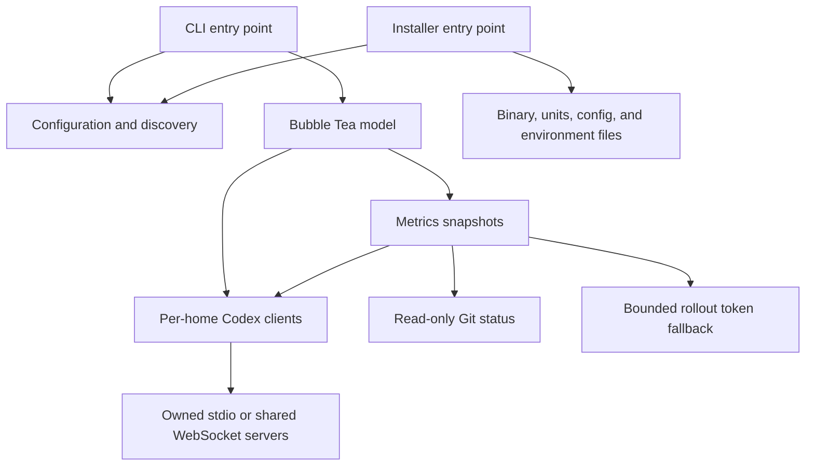

# Development

[Documentation index](README.md)

## Local workflow

Phatmon is a Go module named `phatmon`. Go 1.24+ is required. Make stores module,
toolchain, build, and temporary caches under `.venv/`; `.venv/` is not a Python
environment. Keep `go.mod` and `go.sum` in version control.

| Target | Purpose |
| --- | --- |
| `make init` | Create cache directories and download missing Go dependencies |
| `make build` | Build `bin/phatmon` |
| `make run` | Build and run with normal config-based startup |
| `make demo` | Build and show synthetic sessions with controls disabled |
| `make list-homes` | Print resolved homes without starting servers |
| `make init-config` | Create missing configuration and print its path |
| `make server` | Run a shared app server in the foreground |
| `make codex` | Run Codex connected to the selected shared server |
| `make live` | Connect the dashboard to the standard personal/work endpoints |
| `make live-one` | Connect the selected single home to its endpoint |
| `make install` | Install the binary, user services, and home environment files |
| `make fmt` | Format Go files under `cmd` and `internal` |
| `make fmt-check` | Check formatting without changing files |
| `make vet` | Run Go static checks |
| `make test` | Run tests with the race detector |
| `make check` | Run formatting checks, vet, and race tests |
| `make test-integration` | Exercise the installed Codex protocol in an isolated home |
| `make clean` | Remove `bin/`; keep `.venv/` |
| `make help` | List Make targets and live-connection defaults |

The build/run/test targets initialize their required caches automatically.
`make server` and `make codex` use an already-installed Codex executable.

```sh
make check build
make demo
make run ARGS='--home work=~/.codex-homes/consumable'
make test TEST_ARGS='-run TestDiscovery -count=1'
GOPROXY=off make check build
```

Offline checks require the caches to be populated first. Use `GO` and `GOFMT` to
choose another toolchain. The race detector needs CGO, a supported platform, and a
C compiler such as GCC or Clang. Direct `go` commands use your normal Go cache
configuration rather than the Makefile's project-local settings.

Demo mode uses synthetic sessions and does not connect to accounts or start Codex.
It still follows normal config loading, including creating a missing config file.
Use `--config /tmp/phatmon-demo/config.json` to keep a demo configuration separate.

## Code organization

| Location | Responsibility |
| --- | --- |
| [cmd/phatmon](../cmd/phatmon/main.go) | Parse CLI arguments, resolve configuration, start the TUI |
| [cmd/phatmon-install](../cmd/phatmon-install/main.go) | Parse installer options |
| [internal/config](../internal/config/config.go) | Defaults, validation, atomic persistence, home discovery |
| [internal/codex](../internal/codex/rpc.go) | App-server transport, JSON-RPC routing, protocol types and operations |
| [internal/metrics](../internal/metrics/snapshot.go) | Merge thread snapshots with Git and token usage data |
| [internal/tui](../internal/tui/model.go) | Bubble Tea state, asynchronous commands, rendering, and forms |
| [internal/install](../internal/install/install.go) | User units, executable installation, environment files, legacy cleanup |



## Runtime data flow

Each home has an independent Codex client. A blank endpoint launches
`codex app-server --listen stdio://` with that home's `CODEX_HOME`. A configured
endpoint opens a local WebSocket and validates the server-reported home during
initialization. Requests are matched to responses by ID; server notifications and
requests feed the TUI event loop.

Snapshot polling merges stored and loaded threads, excludes child agents, and
collects Git and historical token data. Live events update statuses, plans,
conversation output, usage, and pending requests. Attaching uses `thread/resume`
to subscribe to a session. Sending uses `turn/start` when idle and `turn/steer`
with the expected turn ID when active.

Rollout fallback reads at most the final 2 MiB of a JSONL file provided by the
server. It validates that the resolved path is inside the registered home and
caches unchanged files. It is a compatibility fallback for an unstable on-disk
format, not the authoritative source of live runtime state.

The installer saves matching endpoints for both the monitor and each home's
`phatmon.env`. It invokes systemctl with argument arrays. It does not install a
client launcher. Codex retains responsibility for account authentication;
Phatmon does not parse `auth.json`.

## Testing strategy

The regular tests use temporary directories, isolated Git repositories, fake
WebSocket servers, and synthetic TUI data. They cover:

- Discovery, explicit overrides, symlink deduplication, and configuration persistence.
- RPC response/event routing, timeouts, pagination, home validation, and turn steering.
- Top-level session filtering, quota bucket/window selection, metrics, and terminal rendering.
- MCP version conflicts and configuration edits.
- Installer files, stable per-home ports, shell quoting, environment mapping, and migration.

`make test-integration` is opt-in and needs Codex on `PATH`. It starts Codex in an
isolated temporary home, exercises user config writes/reload and a fixture skill,
and creates an empty thread. It does not send a model prompt or modify real homes.

For UI work, also inspect `make demo` at narrow and wide terminal sizes. For
installer work, stage destinations with `--no-start --no-home-env` and validate
the generated units with `systemd-analyze --user verify` before trying real services.

## Protocol compatibility

The integration was checked against Codex CLI 0.154.0. The external
[app-server protocol](https://learn.chatgpt.com/docs/app-server) and
[Codex configuration reference](https://learn.chatgpt.com/docs/config-file/config-reference)
can evolve independently of Phatmon. Check installed CLI help and generated schemas
when changing integrations. Keep unavailable metrics unknown rather than supplying
invented values, and preserve per-home isolation when adding operations.

The packages outside `internal/tui` can support a future webview. There is no web
server or webview entry point in the current implementation.

## Contributing

Describe the problem and resulting behavior in a pull request. Include relevant
validation and any protocol limitations. Run `make check` for code changes and
keep examples and docs consistent with CLI options. Documentation-only changes can
be checked through links, config parsing, and shell syntax rather than restarting
real sessions or services.

Report bugs in [GitHub Issues](https://github.com/SuprPhatAnon/phatmon/issues).
Include versions and transport mode, with private conversation content and
credentials removed from excerpts. The repository's license is in [LICENSE](../LICENSE).
