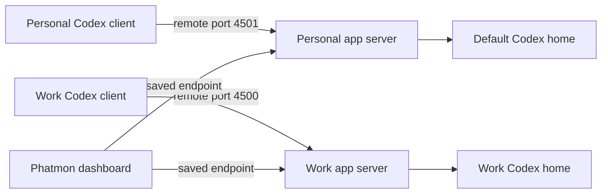

# Live sessions and direnv

[Documentation index](README.md)

## How live connections work

A Codex home groups account state and configuration. An app-server process owns
the live sessions it hosts. For shared control, the Codex client and Phatmon must
connect to the same process for that home.



When a home has no endpoint in Phatmon's config, Phatmon starts its own stdio app
server. That server can read saved history and host sessions, but cannot report
the live state of a session hosted by an independent CLI process. Stored history
is displayed as `STORED · UNKNOWN`.

## Environment variables and client arguments

| Value | Role |
| --- | --- |
| `CODEX_HOME` | Selects the Codex home for the client; also participates in Phatmon home discovery |
| `CODEX_REMOTE` | Environment convention for carrying that home's app-server address |
| Codex `--remote` | Tells the Codex terminal client which server to connect to |
| Phatmon home `endpoint` | Tells Phatmon which server to connect to for that home |

Phatmon reads its endpoint mappings from its config or `--connect`, not from
`CODEX_REMOTE`. It does not add an unsupported remote setting to Codex's
`config.toml`, install a wrapper, or turn an environment variable into CLI arguments.
Use the explicit client command unless your own tooling already supplies the flag:

```sh
codex --remote "$CODEX_REMOTE"
```

Setting or displaying `CODEX_REMOTE` alone does not prove that a client has attached
to that server. See the [Codex app-server documentation](https://learn.chatgpt.com/docs/app-server)
for the supported `--remote` connection.

## Personal defaults in Zsh

After [installation](installation.md), put these defaults in `~/.zshrc`, before
your direnv hook:

```sh
export CODEX_HOME="$HOME/.codex"
export CODEX_REMOTE="ws://127.0.0.1:4501"
```

Alternatively, source the generated file to follow the installer's saved mapping:

```sh
source "$HOME/.codex/phatmon.env"
```

Use one approach. Open a new shell after editing startup configuration. Run Codex
from the project directory in which you want it to work:

```sh
codex --remote "$CODEX_REMOTE"
```

See [personal.zsh](examples/personal.zsh) for the direct-export snippet.

## Work overrides with direnv

For a work project at `~/consumable`, put this in `~/consumable/.envrc`:

```sh
export CODEX_HOME="$HOME/.codex-homes/consumable"
export CODEX_REMOTE="ws://127.0.0.1:4500"
```

Or source the home environment file generated by the installer:

```sh
source_env "$HOME/.codex-homes/consumable/phatmon.env"
```

Use one approach and preserve any unrelated project environment settings. If your
`.envrc` already selects the correct `CODEX_HOME`, only the address export is needed.
After reviewing an edited `.envrc`, allow it and enter the project:

```sh
direnv allow "$HOME/consumable"
cd "$HOME/consumable"
printf 'Home: %s\nServer: %s\n' "$CODEX_HOME" "$CODEX_REMOTE"
codex --remote "$CODEX_REMOTE"
```

Your shell must already have the direnv hook configured. Direnv applies the work
values on entry and restores the previous environment when leaving the directory.
The project directory and Codex home do not need to be the same directory.
See [consumable.envrc](examples/consumable.envrc).

## Open the dashboard and attach

The installer saves all endpoint mappings. Start the dashboard in another terminal:

```sh
~/bin/phatmon
```

1. Select the desired session and press **Enter**.
2. Press **a** and confirm attachment to receive live events.
3. Press **m** to compose; **Ctrl+S** sends. An idle session starts a turn; an active
   session receives steering input for its current turn.
4. Press **i** to interrupt the attached turn when needed.

The home label should match the client home. A loaded session should report
`WORKING`, `IDLE`, or a waiting state rather than `STORED · UNKNOWN`. Refresh with
**r** after starting a previously unavailable server. This session-state check is
more informative than merely seeing a listening TCP port.

To move an existing independently hosted session onto a shared server, exit its
old CLI first, then resume it through the shared endpoint:

```sh
codex resume --remote "$CODEX_REMOTE" SESSION_ID
```

Phatmon does not move running sessions between processes or inject terminal input.

## Manual shared servers

Without systemd installation, run each command below in a separate terminal from
the repository. The Codex homes must already exist.

```sh
# Work and personal app servers; leave both running.
make server
make server SESSION_NAME=personal
```

```sh
# Codex terminals, selecting the corresponding project directories.
make codex SESSION_DIR=/path/to/work/project
make codex SESSION_NAME=personal SESSION_DIR=/path/to/personal/project
```

```sh
# One dashboard connected to both servers.
make live
```

The defaults are work port 4500 and personal port 4501. Set `WORK_ADDR` or
`PERSONAL_ADDR` consistently on all applicable commands to override them. `make
live` always connects the names `consumable` and `personal`, and keeps other
discovered homes visible. For one server use `make live-one`.

For another home, set `SESSION_NAME` and `SERVER_ADDR` explicitly on `make server`,
`make codex`, and `make live-one`. `SESSION_HOME` can override the server/client home
path, which must match Phatmon's resolved path. `SESSION_DIR` defaults to the
repository directory. `CODEX_ARGS` forwards Codex options and `ARGS` forwards
Phatmon options:

```sh
make codex CODEX_ARGS='resume SESSION_ID'
make live ARGS='--connect lab=ws://127.0.0.1:4502'
```

Do not start manual listeners on ports already occupied by the installed services.
Phatmon exits without stopping shared servers; its own stdio servers stop when
Phatmon exits.
